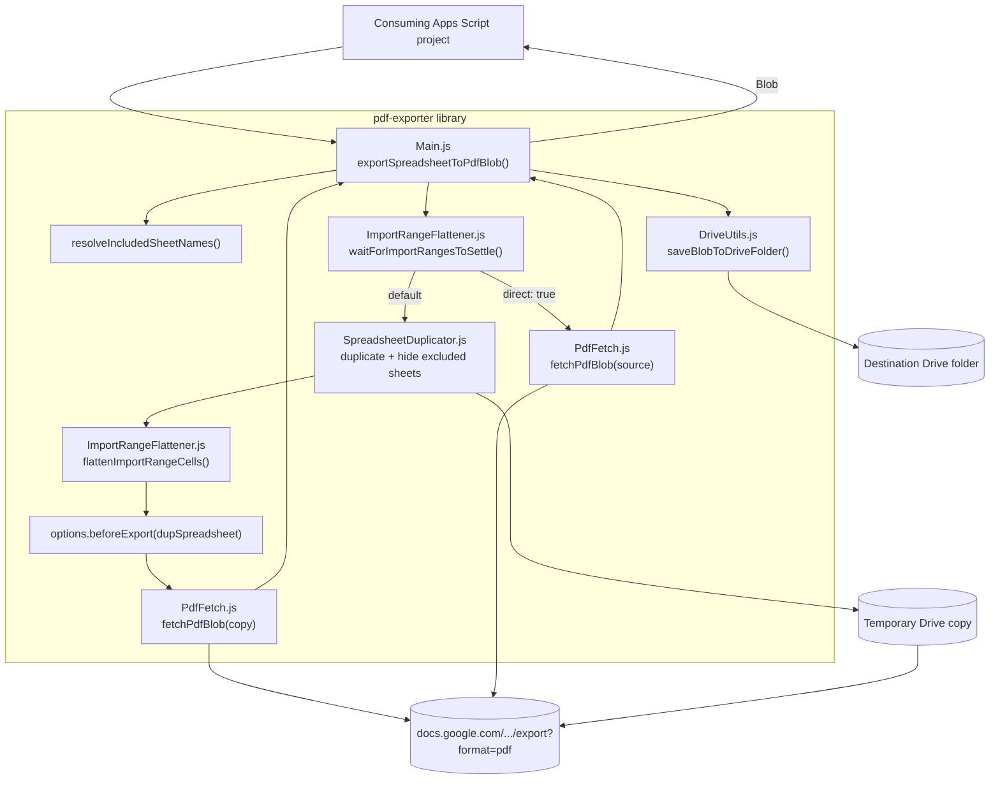

# pdf-exporter

A Google Apps Script library that exports a Google Sheets spreadsheet (or a subset of its sheets) to a PDF file, without ever mutating the source spreadsheet.

## Why

Google Sheets' own PDF export (`File > Download > PDF`, or the `/export?format=pdf` endpoint directly) only exports whatever sheets are currently visible — so exporting a subset means hiding sheets first. Doing that on the live spreadsheet is risky: if anything goes wrong mid-export, sheets can be left hidden, and anyone else with the spreadsheet open sees it flicker. This library instead duplicates the spreadsheet to a temporary Drive file, hides the excluded sheets on the copy, exports from there, and deletes the copy — the source is only ever read.

It also solves a problem that duplication itself introduces: `IMPORTRANGE` access grants are tied to the specific destination file ID, so a fresh Drive copy has never been granted access to whatever external spreadsheet the source imports from, and would render those cells as an access-denied error in the PDF. This library detects `IMPORTRANGE` cells before duplicating and freezes them to their last computed value (read from the already-authorized source), so the export shows real data instead.

## Deploying the library

1. Open the project in the Apps Script editor (`clasp open`, or push first with `clasp push` if you've made local changes).
2. **Deploy > New deployment**, select type **Library**, and create the deployment. Note the **Script ID** shown under **Project Settings** (also the `scriptId` in this repo's `.clasp.json`).
3. Each time you change the library's code, cut a new deployment version (or a new deployment) — consuming projects pin to a specific version number, so old versions keep working until the consumer explicitly updates.

## Connecting the library in another project

1. In the consuming project's Apps Script editor: **Libraries** (left sidebar) > **Add a library**.
2. Paste the library's Script ID, click **Look up**, pick the version to use, and set an identifier (e.g. `PdfExporter`) — this identifier is the namespace you'll call functions through.
3. Add the [required scopes](#required-scopes-in-the-consuming-project) below to the consuming project's own `appsscript.json` — the library's own manifest scopes are not inherited automatically.

## Usage

```js
// Export everything
const blob = PdfExporter.exportSpreadsheetToPdfBlob({ spreadsheetId: '...' });

// spreadsheetId is optional — omit it to export the active spreadsheet
// (only resolvable from a container-bound script or trigger, e.g. a custom menu item)
const blob = PdfExporter.exportSpreadsheetToPdfBlob({});

// Export only specific sheets
const blob = PdfExporter.exportSpreadsheetToPdfBlob({
  spreadsheetId: '...',
  includeSheets: ['Summary', 'Data'],
});

// Export everything except some sheets, saving directly to Drive
const file = PdfExporter.exportSpreadsheetToPdfFile(
  { spreadsheetId: '...', excludeSheets: ['Internal Notes'] },
  'DRIVE_FOLDER_ID'
);

// Tune PDF rendering options
const blob = PdfExporter.exportSpreadsheetToPdfBlob({
  spreadsheetId: '...',
  pdfOptions: { portrait: true, size: 'letter', gridlines: true, margin: 0.25 },
});

// Hide columns per sheet (by sheet name). Each column is a 1-based index, a
// column letter, or a letter range. Hidden on the COPY, so formulas that
// reference those columns keep working.
const blob = PdfExporter.exportSpreadsheetToPdfBlob({
  spreadsheetId: '...',
  hideColumns: { 'Report': [3, 'E:G'], 'Data': ['B'] },
});

// Run extra prep on the temporary Drive copy before export — e.g. collapsing
// row/column groups, or anything else beyond whole-sheet include/exclude.
// Runs against the COPY, never the source spreadsheet.
const blob = PdfExporter.exportSpreadsheetToPdfBlob({
  spreadsheetId: '...',
  beforeExport: (dupSpreadsheet) => {
    const group = dupSpreadsheet.getSheetByName('Data').getRowGroup(2, 1);
    if (group) group.collapse();
  },
});

// Override the base file name (the date/time suffix is still appended)
const blob = PdfExporter.exportSpreadsheetToPdfBlob({
  spreadsheetId: '...',
  fileName: 'Data Export', // → "Data Export 28.07.2026 15:51"
});

// Tune (or skip) the wait for a pending IMPORTRANGE before export
const blob = PdfExporter.exportSpreadsheetToPdfBlob({
  spreadsheetId: '...',
  importRangeWaitTimeoutMs: 120000,     // wait up to 2 min (default 1 min)
  importRangeWaitPollIntervalMs: 5000,  // check every 5s (default 2s)
});

// Simple case: export the whole spreadsheet as-is, skipping the Drive copy
// entirely (no duplicate file, no sheet hiding, no IMPORTRANGE flattening).
// Not compatible with includeSheets/excludeSheets/hideColumns/beforeExport, since there's
// no copy for those to act on.
const blob = PdfExporter.exportSpreadsheetToPdfBlob({
  spreadsheetId: '...',
  direct: true,
});
```

`spreadsheetId` is optional — if omitted, the library falls back to `SpreadsheetApp.getActiveSpreadsheet()`, which only resolves when called from a bound script context (a container-bound script or a simple/installable trigger); calling it without `spreadsheetId` from a standalone script or webapp throws.

`includeSheets` and `excludeSheets` are mutually exclusive — pass at most one. Passing neither exports every sheet. The exported file name is always the spreadsheet's name (or the `fileName` option, if given) with the current date/time appended in `DD.MM.YYYY HH:MM` format, using the source spreadsheet's own time zone.

`direct: true` skips the Drive-copy step and exports the source spreadsheet directly — faster for simple cases that don't need sheet include/exclude, `hideColumns`, or a `beforeExport` hook, since there's no copy for those to act on (combining `direct` with any of them throws). The `IMPORTRANGE` "still loading" wait still applies in direct mode (no flattening is needed, since the source already holds its own access grant), but the temp-file duplication, hiding, flattening, and orphan sweep are all skipped.

### Required scopes in the consuming project

Apps Script's automatic scope detection only scans a project's own code, not the code of libraries it depends on. Any project that adds this library as a dependency must **also** declare these scopes in its own `appsscript.json`, or calls into this library will fail with an authorization error:

```json
"oauthScopes": [
  "https://www.googleapis.com/auth/spreadsheets",
  "https://www.googleapis.com/auth/drive",
  "https://www.googleapis.com/auth/script.external_request"
]
```

## PDF options reference

Passed as `pdfOptions` (see `PdfFetch.js` for the full `PdfExportOptions` typedef):

| Option | Default | Notes |
| --- | --- | --- |
| `portrait` | `false` | `true` for portrait, `false` for landscape. |
| `size` | `'a4'` | `'letter'`, `'legal'`, `'a4'`, ... |
| `fitw` | `true` | Fit sheet width to one page width. |
| `gridlines` | `false` | Include cell gridlines. |
| `printtitle` | `false` | Include the spreadsheet's title above the content. |
| `margin` | `0.5` | Shorthand: sets all four margins, in inches. |
| `topMargin` / `bottomMargin` / `leftMargin` / `rightMargin` | — | Override one margin individually; falls back to `margin`. |
| `extraExportParams` | `{}` | Passthrough object for any other `export?format=pdf` query param not covered above (e.g. `{ pagenum: 'CENTER' }`). |

## How export actually happens

The source spreadsheet is **never mutated**. The library waits for any pending `IMPORTRANGE` on the source to settle, then duplicates it in Drive, hides the excluded sheets on the copy (Google's PDF export endpoint omits hidden sheets — hiding rather than deleting keeps any formula on a visible sheet that references an "excluded" one intact), flattens `IMPORTRANGE` cells on the copy to values read from the source, runs the optional `beforeExport` hook against the copy, fetches the real `.pdf` bytes via Google's native `/export?format=pdf` endpoint, then deletes the temporary copy (retrying on transient failures) — in a `finally`, so it happens even if `beforeExport` or the fetch throws.

With `direct: true`, all of that except the `IMPORTRANGE` wait is skipped: there's no duplicate, no hiding, no flattening, no `beforeExport`, and no orphan sweep — the library fetches the `.pdf` bytes straight from the source spreadsheet's own file ID.

Because Apps Script can hard-kill an execution (the 6-minute timeout, or a manual stop from the Executions dashboard) without ever running its `finally` block, a temp copy can occasionally be left behind with no code able to clean it up. Every export call opportunistically sweeps the source file's parent folders for its own leftover `__pdf_export_tmp__`-prefixed copies older than 15 minutes and trashes them, so orphans from a previous killed run get cleaned up on the next export rather than accumulating indefinitely.

The export URL is always built internally from the resolved spreadsheet's file ID, in `PdfFetch.js` — a caller can never inject an arbitrary host through `pdfOptions`, so there's no host-allowlist check needed.



## IMPORTRANGE handling

`IMPORTRANGE`'s cross-spreadsheet access grant ("Allow access") is tied to the *specific destination file ID*, not to the user or the source spreadsheet in general — so a freshly duplicated copy has never been granted access, even though the source has. There's no Apps Script API to grant that approval programmatically (it's a one-time UI click). Left alone, the duplicate's own evaluation of an `IMPORTRANGE` formula would render as an access-denied error in the exported PDF.

Before duplicating, the library scans every included sheet's formulas for any cell calling `IMPORTRANGE` (including nested, e.g. `SUM(IMPORTRANGE(...))`), waits for each to finish resolving (see below), then — after duplicating and hiding excluded sheets — clears each anchor cell on the copy and writes in the value(s) read from the source, so the PDF renders real data instead of an error. Only `IMPORTRANGE` needs this: other Sheets-only functions (`GOOGLEFINANCE`, `QUERY`, custom Apps Script functions, ...) don't require a per-destination access grant, so they're left as live formulas and simply re-evaluate normally on the copy.

`IMPORTRANGE` typically returns a multi-cell range, not a single value. Apps Script's `SpreadsheetApp` service has no API to query an array formula's result dimensions, so the library detects the spilled extent with a best-effort heuristic: it expands from the anchor cell across contiguous formula-less, non-blank cells. **Known limitation**: a blank cell inside the imported range (a gap in the source data) will cause under-detection past that gap; unrelated data sitting immediately adjacent to the spill with no gap causes over-detection — harmless, since the value written back for an over-detected cell is just its own current value.

### Waiting for a pending IMPORTRANGE

`IMPORTRANGE` computes asynchronously — while still resolving, Sheets shows the placeholder text `"Loading..."` in that cell. If export ran at that exact moment, the placeholder itself would get flattened into the export as a static string. Before duplicating, the library polls the source's `IMPORTRANGE` anchor cells until none show `"Loading..."`, or until `importRangeWaitTimeoutMs` (default 1 minute) elapses, in which case it throws an error naming the exact sheet and cell still stuck. Pass `importRangeWaitTimeoutMs: 0` to skip this check entirely.

## Testing

There's no automated test framework in Apps Script. Test manually from the Apps Script editor: call `exportSpreadsheetToPdfFile({ spreadsheetId, excludeSheets: [...] }, folderId)` (and a run using `beforeExport`) against a scratch spreadsheet, then open the result. Confirm the sheet passed via `excludeSheets` is absent from the PDF, columns passed via `hideColumns` (index, letter, and `'E:G'` range forms) are absent while formulas depending on them still show correct values, any `beforeExport` change (e.g. a collapsed row group) is reflected, and the original spreadsheet is completely unchanged afterward.

Also worth checking once: throw an error inside a `beforeExport` callback and confirm the temporary Drive copy is still deleted (the `finally` in `exportSpreadsheetToPdfBlob` covers it) and the error propagates to the caller.

To verify `direct: true`, call it against a scratch spreadsheet and confirm the PDF matches a manual `File > Download > PDF` of the whole spreadsheet, no temporary Drive file ever appears (even briefly) in the parent folder, and passing it together with `includeSheets`, `excludeSheets`, or `beforeExport` throws.

To verify `IMPORTRANGE` handling, add a sheet with a single-cell `IMPORTRANGE` and one importing a multi-row/column range from another spreadsheet you own. Export and confirm both render real data in the PDF, not an access-denied error. To verify the wait, trigger a re-import (e.g. edit the source range) and immediately run the export with a generous `importRangeWaitTimeoutMs`; confirm it waits and the real values land in the output. With a very small `importRangeWaitTimeoutMs`, confirm it throws, naming the correct sheet and cell.
